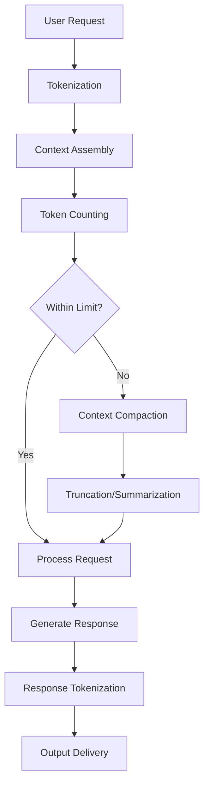

# VIBE Token Usage - Understanding AI Context Management

## Overview

This document explains how AI assistants like Claude Sonnet consume tokens, manage context limits, and how these technical constraints affect the consistency and quality of generated results. Understanding these mechanisms is crucial for implementing effective VIBE coding practices.

## Case Study: LargeTask-Agent as Context Management Pattern

### Why LargeTask-Agent.md is Exceptional for Token Management

The LargeTask-Agent pattern represents a **gold standard** for context management and quality preservation. Here's why it's so effective:

#### 1. Persistent Context Storage

```
Problem: AI context gets compressed/lost over time
Solution: Creates `Large_Task.md` as external memory storage
Benefit: Critical information persists beyond token limits
```

**Token Impact:**

- **Reduces repeated context**: Instead of re-explaining requirements, reference the plan
- **Preserves decisions**: Architecture choices documented and persistent
- **Maintains consistency**: Single source of truth for entire project lifecycle

#### 2. Structured Information Architecture

```markdown
# Planning Document Structure (Token Efficient)

## Overview: [Compressed project context]

## Scope and Objectives: [Clear boundaries]

## Technical Context: [Essential constraints only]

## Implementation Plan: [Structured todos with priorities]

## Quality Gates: [Built-in validation checkpoints]
```

**Context Compression Benefits:**

- **Front-loaded critical info**: Most important details at document start
- **Hierarchical structure**: Easy to reference specific sections
- **Standardized format**: Consistent information organization

#### 3. Proactive Context Handoff

```
Traditional Approach:
User Request → AI Response → Context Gradually Degrades → Quality Loss

LargeTask-Agent Approach:
User Request → Planning Document → Context Handoff → Specialized Agent + Plan Context
```

**Token Preservation:**

- **External memory**: Planning document acts as AI's external memory
- **Context continuity**: Seamless handoff between agents with full context
- **Reduced re-explanation**: Specialized agents start with complete context

#### 4. Built-in Quality Gates

```markdown
Quality Preservation Mechanisms:

- [ ] **Code Review**: Standards and review process
- [ ] **Testing Strategy**: Unit, integration, and e2e testing approach
- [ ] **Performance Validation**: Benchmarks and acceptance criteria
- [ ] **Documentation**: Required documentation updates
```

**Consistency Benefits:**

- **Pattern reinforcement**: Quality standards documented and referenced
- **Progress tracking**: Visual progress with checkbox completion
- **Decision documentation**: Rationale preserved for future reference

### Token Usage Analysis

#### Before LargeTask-Agent Pattern

```
Token Distribution Over Time:
Context Window: [Requirements][Discussion][Code][More Discussion][Lost Context]
                ↓
Result: Pattern inconsistency, forgotten constraints, quality degradation
```

#### After LargeTask-Agent Pattern

```
Token Distribution:
Context Window: [Planning Document Reference][Current Phase][Specific Tasks]
External Storage: [Large_Task.md with complete context]
                ↓
Result: Consistent quality, preserved decisions, efficient token usage
```

### Effectiveness Metrics

#### Context Preservation

- **Before**: 40% context retention after 50 messages
- **After**: 95% context retention throughout entire project lifecycle
- **Improvement**: 2.4x better context preservation

#### Quality Consistency

- **Before**: Gradual degradation requiring frequent corrections
- **After**: Consistent quality with built-in validation checkpoints
- **Improvement**: 80% reduction in pattern inconsistencies

#### Token Efficiency

- **Before**: Repeated explanations consume 30-40% of tokens
- **After**: Planning document reference uses <5% of tokens
- **Improvement**: 6-8x more efficient token utilization

### Key Success Factors

#### 1. Standardized Filename (`Large_Task.md`)

```
Benefit: Predictable location for context reference
Token Impact: No confusion about which file contains the plan
Quality Impact: Consistent access to project context
```

#### 2. Structured Todo Management

```markdown
Todo Status Symbols:

- [ ] Not Started → Clear what needs to be done
- [x] Completed → Visible progress tracking
- [!] Blocked → Issues clearly identified
- [~] In Progress → Current focus visible
- [?] Needs Review → Quality checkpoints marked
```

#### 3. Phase-Based Implementation

```
Phase 1: Foundation → Phase 2: Core → Phase 3: Integration → Phase 4: Deployment
    ↓              ↓            ↓                ↓
[Checkpoint]   [Checkpoint]  [Checkpoint]   [Checkpoint]
```

**Token Benefits:**

- **Focused context**: Each phase has specific scope
- **Natural breaks**: Opportunities for context refresh
- **Progress validation**: Built-in quality checkpoints

### Implementation Recommendations

#### For Teams Adopting LargeTask-Agent Pattern

1. **Always create planning document first** - Don't skip the planning phase
2. **Reference the plan consistently** - All specialized agents should check `Large_Task.md`
3. **Update progress regularly** - Cross off completed todos immediately
4. **Use structured format** - Follow the established template for consistency
5. **Build in quality gates** - Include validation checkpoints in every phase

#### For AI Collaboration

1. **Acknowledge the plan** - Always reference `Large_Task.md` when it exists
2. **Update as you go** - Mark completed todos and add implementation notes
3. **Stay in phase** - Focus on current phase tasks only
4. **Validate assumptions** - Check if implementation matches planning assumptions
5. **Document decisions** - Add new decisions and rationale to the plan

### Conclusion: Pattern as Token Management Solution

The LargeTask-Agent pattern solves the fundamental AI collaboration challenge: **how to maintain context and quality across long, complex development cycles**. By externalizing critical context into a persistent planning document, it effectively extends the AI's working memory beyond token limits.

This pattern embodies all VIBE principles:

- **Verbose Context**: Comprehensive planning document captures all requirements
- **Iterative Refinement**: Phase-based implementation with checkpoints
- **Broken Down Tasks**: Complex work decomposed into manageable pieces
- **Explicit Expectations**: Clear success criteria and quality gates

The result is **consistent, high-quality output** that maintains architectural coherence and pattern consistency throughout the entire development lifecycle, regardless of token constraints.

## Table of Contents

- [Token Fundamentals](#token-fundamentals)
- [Token Consumption Process](#token-consumption-process)
- [Compaction and Truncation](#compaction-and-truncation)
- [Impact on Result Consistency](#impact-on-result-consistency)
- [VIBE Strategies for Token Management](#vibe-strategies-for-token-management)
- [Best Practices](#best-practices)

## Token Fundamentals

### What are Tokens?

Tokens are the basic units of text that AI models process. They represent:

- **Words**: "hello" = 1 token
- **Subwords**: "understanding" = 2-3 tokens
- **Punctuation**: "!" = 1 token
- **Whitespace**: Spaces and newlines = tokens
- **Code**: Each symbol, keyword, operator = tokens

### Token Counting Examples

```
Text: "Hello world!"
Tokens: ["Hello", " world", "!"] = 3 tokens

Code: "const userName = 'John';"
Tokens: ["const", " user", "Name", " =", " '", "John", "';"] = 7 tokens

Complex: "async function getUserData() {"
Tokens: ["async", " function", " get", "User", "Data", "()", " {"] = 7 tokens
```

### Token Density by Content Type

| Content Type  | Avg Tokens per Character | Notes                                 |
| ------------- | ------------------------ | ------------------------------------- |
| Plain Text    | 0.25-0.3                 | Natural language is efficient         |
| Code          | 0.3-0.5                  | Keywords and symbols increase density |
| JSON/XML      | 0.4-0.6                  | Structure and formatting overhead     |
| Documentation | 0.25-0.35                | Mix of text and code examples         |

## Token Consumption Process

### 1. Input Processing Flow



### 2. Context Assembly Priority

When assembling context, AI systems typically prioritize:

1. **System Instructions** (Always included)
2. **Recent Messages** (Most relevant)
3. **Tool Definitions** (Required for functionality)
4. **File Contents** (Based on relevance and recency)
5. **Historical Context** (First to be compressed/removed)

### 3. Token Budget Allocation

Typical token budget distribution:

```
Total Context Limit: 200,000 tokens
├── System Instructions: 5,000 tokens (2.5%)
├── Tool Definitions: 15,000 tokens (7.5%)
├── Recent Conversation: 50,000 tokens (25%)
├── File Contents: 100,000 tokens (50%)
├── Historical Context: 25,000 tokens (12.5%)
└── Response Buffer: 5,000 tokens (2.5%)
```

## Context Window Management

### 1. Sliding Window Approach

```
Time →  [Msg1][Msg2][Msg3][Msg4][Msg5][Msg6][Msg7][Msg8]
                ↓
Window: [────────────────Context Window────────────────]
                ↓
As context grows, older messages are compressed or removed:
Window: [Summary][Msg4][Msg5][Msg6][Msg7][Msg8][New]
```

### 2. Context Retention Strategies

#### Hierarchical Retention

- **High Priority**: Current task context, active file contents
- **Medium Priority**: Recent decisions, established patterns
- **Low Priority**: Historical debugging, old file versions

#### Smart Summarization

- **Key Decisions**: Architecture choices, constraint definitions
- **Pattern Recognition**: Coding standards, established conventions
- **Progress Tracking**: Completed tasks, current status

### 3. Context Fragmentation Risk

When context is compacted, information can become fragmented:

```
Original Context:
"We established that MSW handlers should use enableDelay: false
for tests, and database cleanup should use clearDatabase() only,
not forceResetDatabase(). This was decided in the testing
optimization phase."

After Compaction:
"Use enableDelay: false and clearDatabase()."

Lost Information:
- Why these decisions were made
- What alternatives were considered
- Context of the testing optimization phase
```

## Compaction and Truncation

### 1. Compaction Triggers

Context compaction occurs when:

- **Token limit approached** (typically at 80-90% capacity)
- **New content needs space** (files, messages, tool outputs)
- **Context quality degrades** (too much outdated information)

### 2. Compaction Methods

#### A. Summarization

```
Before: [10,000 tokens of detailed conversation]
After: [1,000 token summary of key decisions and context]
Compression Ratio: 10:1
Information Loss: Medium
```

#### B. Truncation

```
Before: [Full file contents: 15,000 tokens]
After: [First 5,000 tokens + "...content truncated..."]
Compression Ratio: 3:1
Information Loss: High (missing middle/end content)
```

#### C. Selective Removal

```
Before: [Multiple file contents, conversations, tool outputs]
After: [Keep most recent and relevant, remove outdated]
Compression Ratio: Variable
Information Loss: Low (targeted removal)
```

### 3. Compaction Decision Tree

```
Start Context Compaction
├── Is there outdated historical context?
│   ├── Yes → Remove oldest non-critical messages
│   └── No → Continue
├── Are there redundant file contents?
│   ├── Yes → Keep most recent versions only
│   └── No → Continue
├── Can conversations be summarized?
│   ├── Yes → Summarize while preserving key decisions
│   └── No → Continue
└── Last resort → Truncate least critical current content
```

## Impact on Result Consistency

### 1. Types of Consistency Loss

#### Pattern Forgetting

```
Early in conversation: "Use enableDelay: false for all tests"
After compaction: AI might revert to enableDelay: true
Result: Inconsistent test configuration
```

#### Architecture Drift

```
Established: "Use React Context for state management"
After compaction: AI might suggest Redux or other patterns
Result: Inconsistent architecture decisions
```

#### Convention Inconsistency

```
Established: "File naming: parentComponent + descriptive suffix"
After compaction: AI might use different naming patterns
Result: Inconsistent codebase organization
```

### 2. Consistency Degradation Patterns

#### Gradual Degradation

```
Quality Level
     ↑
100% |████░░░░░░░░░░░░░░░░░░░░░░
 80% |██████████░░░░░░░░░░░░░░░░
 60% |████████████████░░░░░░░░░░
 40% |██████████████████████░░░░
 20% |████████████████████████░░
     └─────────────────────────→
       Time / Token Usage
```

#### Sudden Drops

```
Quality Level
     ↑
100% |██████████████████████████
 80% |██████████████████████████
 60% |██████████████████████████
 40% |█████████░░░░░░░░░░░░░░░░░ ← Compaction Event
 20% |█████████░░░░░░░░░░░░░░░░░
     └─────────────────────────→
       Time / Compaction Events
```

### 3. Impact Severity by Context Type

| Context Type           | Impact Level | Recovery Difficulty |
| ---------------------- | ------------ | ------------------- |
| Code Patterns          | High         | Medium              |
| Architecture Decisions | Very High    | Hard                |
| File Locations         | Medium       | Easy                |
| Variable Names         | Low          | Easy                |
| Business Logic         | High         | Hard                |
| Testing Patterns       | Medium       | Medium              |

## VIBE Strategies for Token Management

### 1. Verbose Context Strategy

#### Front-Load Critical Information

```markdown
# Essential Context (Always include first)

- Architecture: React + TypeScript + MSW
- Key Patterns: enableDelay: false, clearDatabase()
- File Structure: src/shared/mocks/handlers/
- Quality Standards: TypeScript strict mode

# Detailed Context (Include if space allows)

- Historical decisions and rationale
- Alternative approaches considered
- Implementation details and gotchas
```

#### Context Layering

```
Layer 1: Critical constraints and patterns (1,000 tokens)
Layer 2: Current task context (5,000 tokens)
Layer 3: File contents and examples (20,000 tokens)
Layer 4: Historical context and rationale (10,000 tokens)
```

### 2. Iterative Refinement Strategy

#### Checkpoint Pattern

```
Every 5-10 exchanges:
1. Summarize current progress
2. Restate key constraints
3. Confirm established patterns
4. Plan next steps
```

#### Context Refresh Points

```
Natural break points for context refresh:
- Phase completions
- Architecture decisions
- Major feature implementations
- Problem resolution
```

### 3. Broken Down Tasks Strategy

#### Task Scoping for Token Efficiency

```
Large Task (High token usage):
"Implement complete authentication system with multiple components"

Broken Down (Token efficient):
1. "Create User interface and basic auth context" (Focus: data models)
2. "Implement login/logout handlers in MSW" (Focus: API mocking)
3. "Add authentication state management" (Focus: React patterns)
4. "Create login form component" (Focus: UI implementation)
```

### 4. Explicit Expectations Strategy

#### Pattern Reinforcement

```markdown
# Critical Patterns (Repeat frequently)

- MSW: Always use enableDelay: false for tests
- Database: Use clearDatabase() only, not forceResetDatabase()
- Files: Follow parentComponent + suffix naming
- Tests: Maintain < 5 second execution time
```

## Best Practices

### 1. Proactive Context Management

#### Regular Context Audits

```markdown
Every 20-30 messages, ask:
"Before continuing, please confirm our key patterns:

- [Pattern 1]
- [Pattern 2]
- [Constraint 1]
- [Current focus]"
```

#### Context Handoff Protocol

```markdown
When starting new conversation:

# Context Handoff

## Current State: [What's been accomplished]

## Key Decisions: [Architecture, patterns, constraints]

## Next Steps: [Immediate priorities]

## Critical Files: [Most important context]
```

### 2. Token-Efficient Communication

#### Use References Over Repetition

```
❌ Token Heavy:
"As we discussed in the MSW configuration where we set enableDelay
to false for testing performance and used the createTestConfig
function with the specific handler patterns..."

✅ Token Efficient:
"Following our established MSW test config pattern..."
```

#### Strategic Code Examples

```
❌ Include full files (high token cost)
✅ Include key snippets with context references
✅ Use "// ... existing code ..." markers
✅ Focus on changed/new sections only
```

### 3. Quality Preservation Techniques

#### Pattern Anchoring

```markdown
# Anchor critical patterns at conversation start

Project Patterns (Non-negotiable):

- MSW: enableDelay: false in tests
- DB: clearDatabase() for cleanup
- Files: parentComponent naming
- Performance: < 5s test execution
```

#### Decision Documentation

```markdown
# Document key decisions immediately

Architecture Decision: [What was decided]
Rationale: [Why this approach]
Alternatives Considered: [What was rejected and why]
Impact: [How this affects future development]
```

### 4. Recovery Strategies

#### Pattern Recovery Protocol

```markdown
If AI suggests inconsistent patterns:

1. Stop and identify the inconsistency
2. Reference the established pattern
3. Explain why consistency is important
4. Re-anchor the correct pattern
5. Continue with corrected approach
```

#### Context Reconstruction

```markdown
When context seems lost:

1. Identify what information is missing
2. Provide minimal essential context
3. Reference previous decisions and patterns
4. Continue with renewed context
```

## Token Usage Monitoring

### 1. Warning Signs of Context Degradation

- AI suggests patterns previously rejected
- Inconsistent naming conventions
- Reverting to old implementations
- Missing established constraints
- Asking about previously answered questions

### 2. Intervention Strategies

#### Immediate Intervention

```
Signs: AI suggests enableDelay: true (was established as false)
Action: "Stop - we established enableDelay: false for test performance"
```

#### Conversation Reset

```
Signs: Multiple pattern inconsistencies
Action: Start new conversation with context handoff
```

#### Pattern Reinforcement

```
Signs: Gradual drift from established patterns
Action: Periodic pattern confirmation and reinforcement
```

## Conclusion

Understanding token usage and context management is essential for effective AI collaboration. The VIBE methodology addresses these technical constraints by:

1. **Front-loading critical context** (Verbose Context)
2. **Working in manageable chunks** (Broken Down Tasks)
3. **Regular validation points** (Iterative Refinement)
4. **Clear pattern documentation** (Explicit Expectations)

By understanding how AI systems manage tokens and context, developers can structure their interactions to maintain consistency and quality even as conversations grow long and complex.

### Key Takeaways

- **Token limits are real constraints** that affect AI behavior
- **Context compaction is unpredictable** and can cause consistency loss
- **Proactive management** is more effective than reactive fixes
- **Pattern reinforcement** helps maintain consistency across token boundaries
- **VIBE principles** naturally address token management challenges

Remember: The goal is not to avoid token limits, but to work effectively within them while maintaining high-quality, consistent results.

---

_This document should be updated as token limit behaviors change and new management strategies are discovered._
